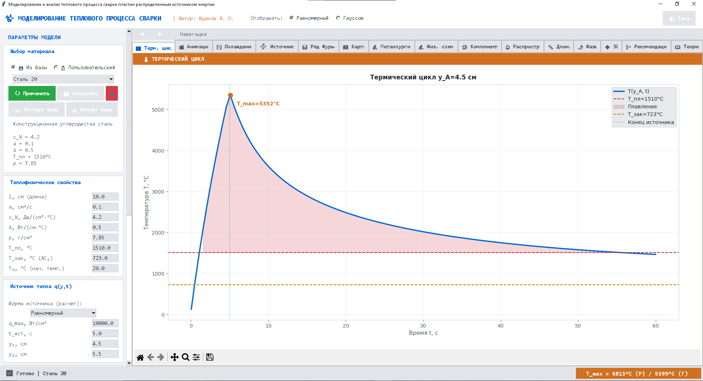
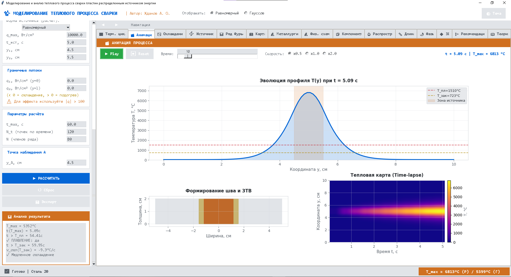

# Моделирование теплового процесса сварки пластин

[](https://www.python.org/)
[](https://pytest.org/)

Программа для расчёта температурных полей при сварке. Разработана для диплома (ВятГУ, Прикладная математика).

## Зачем это нужно

Когда варишь металл, важно понять:
- Насколько он нагреется?
- Какой получится шов?
- Не будет ли трещин из-за быстрого охлаждения?

Обычно для этого используют COMSOL или ANSYS — это мощные программы, но для простых задач они избыточны: нужно строить 3D-модель, ждать расчёт несколько минут, вручную вытаскивать данные.

Я сделал программу, которая считает **за 3-5 секунд** одномерную задачу теплопроводности методом конечных интегральных преобразований (КИП). Точность — около 3-5% по сравнению с МКЭ, но зато можно быстро перебирать параметры и смотреть, что изменится.

## Что умеет программа

**Расчёт:**
- Два типа источника тепла: прямоугольный и гауссов (плавный)
- Автоматический расчёт ширины шва и ЗТВ (зоны термического влияния)
- Параметр t₈/₅ (время охлаждения 800→500°C) для прогноза структуры
- Скорости нагрева и охлаждения

**Визуализация:**
- 14 вкладок с графиками: термические циклы, тепловые карты, 3D-поверхности
- Анимация процесса (можно посмотреть, как распространяется тепло)
- Разложение решения на компоненты (начальное условие + источник + граничные потоки)

**Материалы:**
- Встроены: Сталь 20, Сталь 45, Сталь 09Г2С, Алюминий АМг5, Титан ВТ6, Медь М1
- Можно добавить свои сплавы через JSON

## Примеры работы


*Рис. 1. Интерфейс программы. Слева — параметры (материал, мощность источника), справа — графики.*


*Рис. 2. Анимация: видно, как растёт шов (красный) и ЗТВ (жёлтый) при нагреве.*

## Как запустить

1. **Установи Python 3.12+** (если ещё нет)

2. **Скачай проект:**
   ```bash
   git clone https://github.com/soulrival/Diploma.git
   cd Diploma
   ```

3. **Установи зависимости:**
   ```bash
   pip install -r requirements.txt
   ```

(там всего две библиотеки: numpy и matplotlib)

4. **Запусти:**
   ```bash
   python main.py
   ```
   

## Как пользоваться

1. Выбери материал из списка (или задай свои свойства вручную)
2. Настрой источник тепла:
- Для прямоугольного: укажи границы y₁ и y₂
- Для гауссова: задай коэффициент сосредоточенности k
3. Нажми "▶ РАССЧИТАТЬ"
4. Смотри результаты во вкладках:
- "**Терм. цикл**" — график T(t) в точке наблюдения
- "**Карта**" — тепловая карта T(y,t)
- "**Анимация**" — динамика процесса
- "**Металлургия**" — прогноз структуры и CCT-диаграмма

## Тесты

Программа покрыта тестами (34 теста, 84% покрытия кода). Чтобы запустить:
   ```bash
   pytest tests/ -v --cov=core
   ```

Это проверяет:
- Математическое ядро (сходимость ряда Фурье, граничные условия)
- Аналитику (расчёт ширины шва, t₈/₅)
- Работу с базой материалов

## Ограничения модели

Важно понимать:
- Это одномерная модель (только по ширине пластины). Не учитывает глубину и длину шва.
- Для 1D-модели нужно снижать мощность источника по сравнению с реальными 3D-параметрами (иначе будет нереалистичный перегрев >5000°C).
- Граничные условия — теплоизоляция (нет отвода тепла через границы).

Если нужна точная 3D-модель — используй COMSOL или ANSYS. Эта программа — для быстрой оценки и подбора параметров.

## Структура проекта

   ```bash
   welding_sim/
   ├── main.py                    # Запуск программы
   ├── requirements.txt           # Зависимости
   ├── core/                      # Математическое ядро
   │   ├── math_engine.py         # Решатель (метод КИП)
   │   ├── analytics.py           # Расчёт метрик (t8/5, ширина шва)
   │   └── materials.py           # База материалов
   ├── gui/                       # Интерфейс
   │   ├── app.py                 # Класс WeldingApp
   │   └── plots.py               # Стили графиков
   ├── tests/                     # Тесты
   │   ├── unit/                  # Модульные тесты
   │   └── integration/           # Интеграционные тесты
   └── docs/                      # Скриншоты для README
   ```

## Литература

Основные источники:
1. Мелюков В.В. Оптимизация режима обработки материалов концентрированными потоками энергии. – Киров: ВятГУ, 2003.
2. Рыкалин Н.Н. Расчёты тепловых процессов при сварке. – Москва: Машгиз, 1951.

## Автор

**Жданов Артем Олегович**
Вятский государственный университет, 01.03.02 Прикладная математика и информатика

GitHub: [soulrival/Diploma](https://github.com/soulrival/Diploma)

_**Разработано в рамках преддипломной практики в ООО «Вятский аттестационный центр» (2026)**_